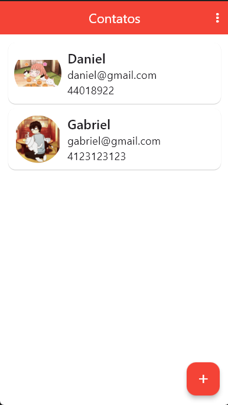

# Agenda De Contatos

Utlizando Flutter e Dart. 

## Apresentação

App do Criação de Apps Android/iOS/Web com Flutter - 5 cursos em 1.
Códigos atualizando para o mais recente momento do Dart 20/12.
Utilizando-se também Dependencias como:
sqflite(Mobile) sqflite_common_ffi(Destok)
url_launcher
mage_picker

